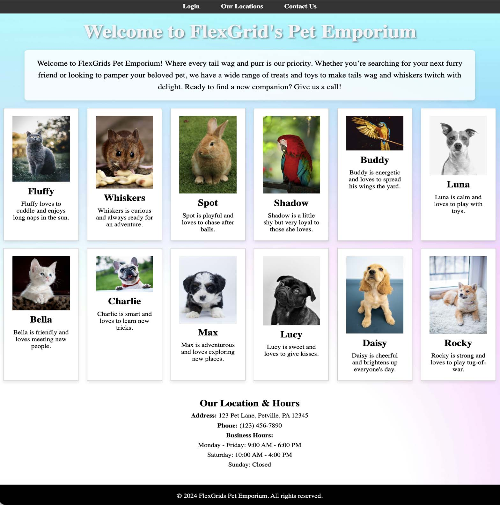

# AI Generated Flexbox and Grid Page

## FlexGrid Pet Emporium

##

## Description 📄
In this assignment, you'll create a responsive pet store webpage titled "FlexGrid's Pet Emporium" using Flexbox and CSS Grid, with step-by-step guidance from AI.

## Expected Project Structure 🏗️

```
FlexGridsPetEmporium
│   index.html
│   styles.css
└───assets
    └───images
```

# Instructions ✅

## 1. **Create the Project Folder and Files**
   - [ ] Create a folder named `FlexGridsPetEmporium`to store all your project files.
   
   - [ ] Inside the `FlexGridsPetEmporium` folder, create a file named `index.html`. This will be your main HTML file.
   
   - [ ] Also, in the `FlexGridsPetEmporium` folder, create another file named `styles.css`. This file will contain the CSS used to style your HTML content.

   - [ ] Create a folder named `assets`.

   - [ ] Create another folder named `images` inside the assets folder.


## 2. **Download Pet Photos:**
   - [ ] Go to [Pexels.com](https://www.pexels.com) and download 12 pet photos of your choice.

## 3. **Rename the Photos:**
   - [ ] Rename the downloaded photos to shorter names for easier reference, such as `Pet1.jpg`, `Pet2.jpg`, ..., `Pet12.jpg`.

## 4. **Place the Photos in the images Folder:**
   - [ ] Move the downloaded (and renamed) pet photos into the `images` folder inside the `assets` folder.

## 5. **Download Background Image:**
   - [ ] Go to [Pexels.com](https://www.pexels.com) and search for light background images.
   - [ ] Find something that you think will work with your Pet Store site and download it.
   - [ ] Rename this image to `Background.jpg` and also place it in the `assets/images` folder.

##
Now begin coding with the help of AI.
##

## 6. **Add HTML Boilerplate And Background Image**
Now that you have your files set up, start by adding the basic HTML5 boilerplate and the basic structure for our web page including the background image.

  - [ ] Ask AI to generate an HTML boilerplate for a webpage that includes a `header` with an `h1` tag, a `main` content area that includes a `p` tag, and a `footer`. The page should be titled 'FlexGrid's Pet Emporium' and linked to a CSS file. Please include a witty description for a pet store in the main content area, using a `p` tag with the class store-description.

  - [ ] Now add the image named 'Background.jpg' as a background to the project. The background should cover the entire page, be centered, and have a no-repeat, fixed image property.

  - [ ] Copy all of the HTML boilerplate code provided by AI and paste it into your `index.html` file.

**Explanation:**
In this step, you can set up the basic structure of your webpage by asking AI to generate an HTML5 boilerplate, including a header and main content area, which you can then copy and paste into the index.html file.

## 7. **Add Navigation Bar Code**
In this step, you'll ask AI for help to add a navigation bar to your webpage that includes options for "Login," "Our Locations," and "Contact Us." 

  - [ ]  You need `HTML` code to add a navigation bar with "Login," "Our Locations," and "Contact Us" options to the existing HTML boilerplate. The nav bar will be a black bar at the top once it is styled. 
  - [ ] Open your `index.html` file. and locate the `<header>` tag. Paste the navigation bar code between the `<body>` and the `<header>` tags.

**Explanation:**
This step introduces a navigation bar that will allow users to easily access key sections of your site. By placing the code between the <body> and <header> tags, you ensure that the navigation bar appears at the top of your webpage, making it prominent and user-friendly.


## 8. **Add Pet Image Boxes Section**
Now that you have a navigation bar, add 12 boxes for the pet photos with cute pet names and short personality descriptions.

  - [ ] Ask for help to create `HTML` code adding a section under the main content area with 12 image boxes for pet photos. The photos are located in the assets/images folder. The photos are named Pet1.jpg to Pet12.jpg. Each box should have an image, a cute pet name, and a short personality description underneath. Please ensure this code uses a `<section>` tag with a class of "pet-gallery".  
  - [ ] Open your `index.html` file and locate the existing `<main>` tag. This tag should already contain the initial `<p>` tag with the business description.
  - [ ] Paste the code for the pet images `<section>` directly below the existing `<p>` tag inside the `<main>`. This will ensure that the pet image boxes section appears right after the business description.
  
**Explanation:**
In this step, you enhanced the webpage by adding a section that showcases 12 pet photos, each accompanied by a cute pet name and a brief personality description. This section will be visually appealing and give users a glimpse of the adorable pets featured in your store.

## 9. **Add a Section for Location and Hours**
Next, let's add a section for the location and hours. 

- [ ] You now need HTML code to add a `section` for location and hours, including an address, phone number, and business hours. Give this section code a class of "location-hours"
- [ ] Open your `index.html` file and locate the existing `<footer>` tag in your `index.html` file.
- [ ] Paste the location and hours `section` code directly above the `<footer>` tag.

**Explanation:**
In this step, you're adding a section to your webpage that provides essential information about your business, including the location, contact details, and operating hours.

## 10. **Test your current progress**
Review your progress by viewing the current unstyled webpage in the browser.

- [ ] Open your index.html file in the browser and review the current progress

The unstyled page should resemble something like this:
##

##


## 11. **Add Basic Styles**
Ask AI for help to add some CSS code to your `styles.css` file.

  - [ ] Provide CSS code to set some basic styles, such as margin, padding, and box-sizing for all elements, and set a font for the body.
  - [ ] Copy the CSS code  and paste it in your `styles.css` file.

**Explanation:**
In this step, you're establishing the foundational styling for your webpage by setting universal styles for all elements. 

## 12. **Style the Navigation Bar**
Now you can style your Navigation bar for your project.

  - [ ] Copy and paste the nav bar code from your `index.html` into an AI chat, include everything from <nav> to </nav>. Ask AI to use this HTML code as a reference when building the upcoming CSS requests.
  - [ ] You now need CSS code to style the header and navigation bar, making the nav bar full width, a black background, and locate it at the top of the page.
  - [ ] The text should all be white in color. 
  - [ ] Please use Flexbox to handle the layout and ensure any text is centered within the navigation bar. Make sure to use the navigation `HTML code` supplied previously for reference when building the CSS.
  - [ ] Copy the CSS code provided by the AI and paste it next in the `styles.css` file.

**Explanation:**
This step involves styling the navigation bar to make it full-width with a black background and centered white text, using Flexbox for layout.

## 13. **Style the h1 Page Title**
In this step, you'll focus on styling the h1 page title to make it visually prominent and aligned with the overall design of the webpage.
 
  - [ ] Provide CSS code to style the `<h1>` header.  The header should be big, bold, centered, and include a shadow effect.
  - [ ] Open your `styles.css` file and paste the supplied CSS code for the `<h1>` header next in the file.

**Explanation:**
In this step, you styled the `<h1>` page title using CSS making it big, bold, and centered.

## 14.  **Style the Company Description `<p>` Tag**
In this step, you'll style the company description `<p>` tag to ensure it is visually appealing and consistent with the overall design of the webpage.

  - [ ] Provide CSS code to style the `<p>` tag with the class of store-description. The paragraph should be centered under the `<h1>` header and appear in a box with a transparent, lighter background color and a border around it. The box should adjust responsively with the screen size and include padding and margins for spacing.
  - [ ] Open your `styles.css` file and paste the supplied CSS code for the `.store-description` class `<p>` tag next in the `styles.css` file.

**Explanation:**
In this step, you styled the .store-description `<p>` tag to appear centered under the `<h1>` header.

## 15. **Style the Pet Gallery Section**
In this step, you'll style the Pet Gallery section by using CSS Grid to create a responsive layout for the pet photo boxes.

  - [ ] Paste the code from the `index.html` file from the entire pet gallery section tags (`<section class="pet-gallery">` all your code `</section>`). Ask AI to use this HTML code as a reference when building the upcoming CSS requests.
  - [ ] You need CSS code to style the pet photo boxes in the `.pet-gallery` section.
  I need all of the following included in the layout: 
     - use CSS grid
     - The pet name (`<h3>`) should be larger and positioned at the top in each box.
     - There should be no rule between the pet name and the description (`<p>` tag).
     - Each box should have a border around it, and the photo should have a rule separating it from the description.
     - Ensure there are no more than 6 boxes per row. All boxes should have a white background and be responsive to browser size changes.
     - There should also be a small margin of space on the right and left side of the web page.
  - [ ] Open your `styles.css` file and paste the new CSS code for the `.pet-gallery` section next in the `styles.css` file.

**Explanation:**
In this step, you focused on styling the Pet Gallery section by using CSS Grid to create a visually appealing and responsive layout for the pet photo boxes.  

## 16. **Style the Location and Hours Section**
In this step, you're focusing on styling the Location and Hours section by using the .location-hours class. 

  - [ ] Provide me the CSS code to style the location and hours section. Use a `<section>` class of `location-hours` to style it. The section should be centered on the page with text aligned in the center. Ensure the background of the section is fully transparent, include extra spacing between lines of text, and add padding around the section. There should be no border around the section and any list items inside should not have dots (bullets). The content should be responsive to different screen sizes.
  - [ ] Open your `styles.css` file and paste the supplied CSS code for the `.location-hours` class next in the `styles.css` file.

**Explanation:**
In this step, you generated CSS code to style the Location and Hours section by centering the section and its text on the page, adding extra spacing between lines, and padding around the content.

## 17. **Style the Footer**
Finally, you'll style the footer to ensure it stands out and complements the overall design.

- [ ] You now need CSS code to style the footer. I need the footer to have a black background with white text. Ensure that the text is centered within the footer, and include padding around the content. The footer should be styled to be visually distinct and stand out from the rest of the page.
- [ ] Open your `styles.css` file and paste the supplied CSS code for the `footer` tag next in the `styles.css` file.

**Explanation:**
In this step, you generated CSS code to style the footer with a black background and white, centered text, ensuring it stands out from the rest of the page. After creating the CSS, you pasted it into the styles.css file to apply the styles to the footer.

## 18. **Test the Results**
In this step, you'll test your webpage in the browser to ensure it resembles the example and make any desired adjustments.

- [ ] Test your `index.html` file in the browser now, you should see a web page that somewhat resembles the example at the top of this README.
- [ ] Feel free to add more CSS and HTML, as well as tweak the current code. 
- [ ] Customize and enhance your page and make it your own as you see fit. 

**Explanation:**
This final step is about verifying that the webpage functions and appears as intended, allowing you to make additional customizations and refinements to personalize and perfect your design.

## 19. **Commit and Push to Github**
 - [ ] Commit and push your work to Github.

 # Conclusion 📄
You can review this project with an AI assistant to help better understand your work.

***Consider asking it the following:***
1. Can you explain my final HTML and CSS code?
2. How does the HTML structure support the overall design?
3. What is the purpose of each CSS rule in the stylesheet?
4. Are there any potential improvements or optimizations for the code?
5. How does this code implement best practices in web development?

##

### Solution codebase 👀
🛑 **Only use this as a reference** 🛑

💾 **Not something to copy and paste** 💾

**Note:**  This lab references a solution file located [here](https://github.com/HackerUSA-CE/aisd-wde-5-ai-flexbox-and-css-grid/tree/solution) (link not shown).


---

© All rights reserved to ThriveDX
